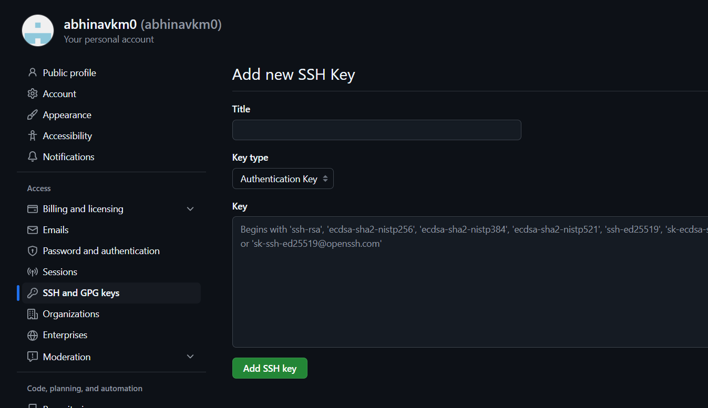

# Environment Setup

We will be working inside WSL

First, install wsl

```bash
wsl --install
```

Install the Ubuntu distro

```bash
wsl --install -d Ubuntu
```

Set the default version to WSL2

```bash
wsl --set-default-version 2
```

### WSL2

Now you can enter wsl to open a shell


### Docker Desktop

Download and install [Docker Desktop](https://www.docker.com/products/docker-desktop/)

Now, enable WSL2 integration 


### Create SSH Key

Create an SSH Key 

```bash
ssh-keygen -t rsa -b 4096 -C "email@thoughtminds.io"
```

Add to identity

```bash
ssh-add ~/.ssh/file_name
```

Now copy contents of the `.pub` file to GitHub SSH Keys




### Install pyenv

```bash
curl -fsSL https://pyenv.run | bash
```

Refer [this](https://github.com/pyenv/pyenv?tab=readme-ov-file#b-set-up-your-shell-environment-for-pyenv) for setup

Zsh users can do this

```bash
echo 'export PYENV_ROOT="$HOME/.pyenv"' >> ~/.zshrc
echo '[[ -d $PYENV_ROOT/bin ]] && export PATH="$PYENV_ROOT/bin:$PATH"' >> ~/.zshrc
echo 'eval "$(pyenv init - zsh)"' >> ~/.zshrc
```

Now you can install a python version using pyenv

```bash
pyenv install 3.10.5
```

If this throws an error install gcc

```bash
sudo apt install -y software-properties-common
```

I recommend setting a python version to be the default

```bash
pyenv global 3.10.5
```

### Install pipenv

```bash
python -m pip install pipenv
```

To initialize simply run

```bash
pipenv install
```

Once you have a Pipfile, start installing packages

Eg:

```bash
pipenv install tqdm
```